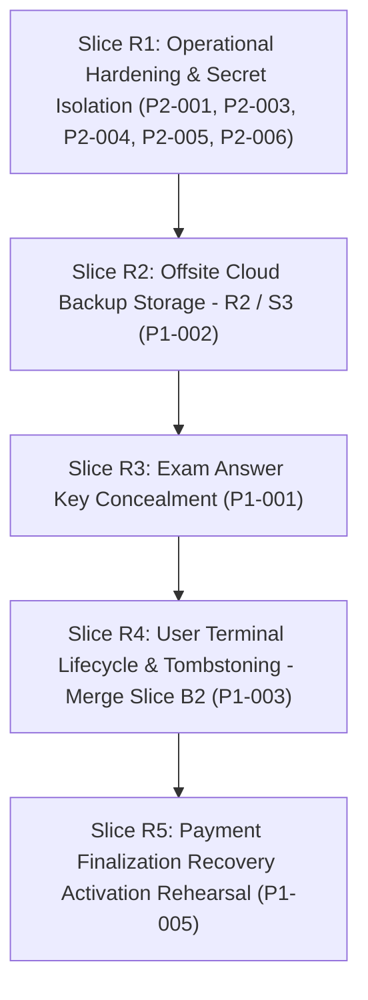

# GovStudyX Post-Launch Production Readiness Re-Audit

**Audit Date:** September 6, 2026
**Auditor:** Antigravity Senior Engineering & Security Architecture Team
**Worktree:** `C:\Users\Administrator\govstudyx-readiness`
**Current Branch:** `readiness/post-launch-hardening`
**Baseline Commit:** `7bce0b0234d57fc806e20742f5b056617fc3fac2`
**Production Status:** Live in Production & Operational

---

## 1. Executive Summary

A comprehensive post-launch production readiness re-audit of the GovStudyX platform was conducted on the current source baseline (`7bce0b0234d57fc806e20742f5b056617fc3fac2`). Prior audit records, commit histories, and all core architectural subsystems (Security, Dependencies, Payments & Accounting, Database & Prisma, Backup & Recovery, API Reliability, Operations, and Build Quality) were inspected against actual repository files and current runtime behaviors.

### Overall Status Breakdown

| Severity | Total Findings | Open | Partially Resolved / Contained | Closed | Needs Production Verification | Accepted Risk |
| :--- | :---: | :---: | :---: | :---: | :---: | :---: |
| **P0 (Critical)** | 3 | 0 | 0 | 1 | 0 | 0 |
| **P1 (High)** | 5 | 2 | 3 | 0 | 0 | 0 |
| **P2 (Medium)** | 6 | 6 | 0 | 0 | 0 | 0 |
| **P3 (Low / Info)** | 3 | 2 | 0 | 0 | 0 | 1 |
| **Operational Verifications** | 5 | 0 | 0 | 0 | 5 | 0 |
| **Closed Baseline Findings** | 10 | 0 | 0 | 10 | 0 | 0 |

### Key Executive Conclusions

1. **No Active, Uncontained P0 Breaches:**
   - **GSA-P0-001 (Credential Exposure):** Closed. Bootstrap admin passwords were scrubbed, and production credentials/JWT secrets were rotated.
   - **GSA-P0-002 (Destructive User Purge):** Operationally contained via fail-closed code (`USER_HARD_PURGE_DISABLED_CODE`). Physical user deletion is completely blocked, protecting financial ledgers. Long-term anonymization (Slice B2) is designed and implemented on branch `security/p0-002-b2-terminal-lifecycle` awaiting merge.
   - **GSA-P0-003 (Unsafe Database Restore):** Operationally contained via fail-closed code (`P0_003_RESTORE_DISABLED_CODE`, HTTP 503). In-app database restore cannot be triggered.
2. **Top Open P1 Vulnerabilities:**
   - **Exam Answer Key Exposure:** `/api/exam/start` pre-sends `answerIndex`, `explanation`, and all reasoning strategies in the initial GET response. The client component (`mock-exam/take/page.tsx`) uses this for local scoring, allowing any test taker to inspect answers before submission.
   - **Offsite Backup Storage Deficit:** Backups are written to local `/tmp` (ephemeral in serverless) and to a table (`BackupPayload`) inside the *same* PostgreSQL database being backed up. Destruction or corruption of the PostgreSQL database destroys both primary data and backups simultaneously.
3. **Financial & Payment Integrity:**
   - The live PayMongo payment flow (`paymentFinalizationService.ts`) utilizes PostgreSQL transaction-scoped advisory locks (`pg_advisory_xact_lock`), status verification, and idempotent transaction upserts to guarantee that verified payments cannot be double-processed into subscriptions.
   - Downstream accounting side effects (ledger, referral, partner commission, and tax provisioning) are called outside the transaction in try/catches. The durable finalization recovery coordinator (P1-001) has been created to guarantee transactional recovery, and is **strictly dormant** with 0 application callers as instructed.
4. **Dependency Health:**
   - `npm audit` reports 10 vulnerabilities (2 moderate, 8 high).
   - `npm audit fix --force` must **never** be executed: it attempts a breaking downgrade of Prisma from v7.9.1 to v6.19.3 and `@serwist/next` to v9.4.1. The majority of high-severity vulnerabilities (`deepmerge-ts`, `mysql2`, `fast-uri`, `js-yaml`) exist solely in devDependencies (`prisma`, `eslint`) with zero runtime exposure.
5. **Parallel Safety with Performance Slice 4:**
   - Performance Slice 4 focuses strictly on cache architecture (`src/lib/cache.ts`, `src/lib/clientCache.ts`, read endpoints `/api/pricing`, `/api/csc`, `/api/reviewer`).
   - The proposed **Readiness Slice R1** modifies isolated API routes (`/api/admin/questions/ai-generate`, `/api/health/readiness`, `/api/exam/history`, `/lib/crypto/encryption.ts`) with **zero file collisions**, allowing safe parallel development.

---

## 2. Production Baseline

| Metric / Attribute | Observed Baseline Value |
| :--- | :--- |
| **Repository Worktree** | `C:\Users\Administrator\govstudyx-readiness` |
| **Active Git Branch** | `readiness/post-launch-hardening` |
| **Tracking Upstream** | `origin/main` |
| **HEAD Commit Hash** | `7bce0b0234d57fc806e20742f5b056617fc3fac2` |
| **Commit Subject** | `test(payment): allow postgres harnesses on integration branch` |
| **Working Tree Status** | Clean (0 staged, 0 unstaged, 0 untracked modifications) |
| **Node.js Runtime** | `v24.19.0` |
| **Package Manager** | `npm 11.17.0` |
| **Next.js Version** | `16.3.2` |
| **React Version** | `19.2.4` |
| **Prisma ORM Version** | `7.9.1` with `@prisma/adapter-pg 7.9.1` |
| **Database Engine** | PostgreSQL with `pg 8.22.0` pooling |
| **Rate Limiter Engine** | Upstash Redis (`@upstash/ratelimit 2.0.8`, `@upstash/redis 1.38.2`) |

---

## 3. Closed Findings

The following security and operational items have been verified as **CLOSED** in the current source code:

| Finding ID | Title | Route / File | Resolution Proof / Evidence |
| :--- | :--- | :--- | :--- |
| **GSA-P0-001** | Bootstrap Admin Password Exposure | `src/lib/auth.ts`, `src/app/api/auth/reset-password/route.ts` | Remediated in source; hardcoded passwords scrubbed; production credential and `JWT_SECRET` rotation completed and documented in `P0-001-PRODUCTION-CLOSURE.md`. |
| **GSA-SEC-001** | Forgot Password User Enumeration | `src/app/api/auth/forgot-password/route.ts`, `src/app/api/partner/auth/forgot-password/route.ts` | Both routes unconditionally return identical generic success messages (`If an account exists...`) regardless of user existence, role, or error. |
| **GSA-SEC-002** | Permissions-Policy Microphone Restriction | `next.config.ts` | Configured with `Permissions-Policy: camera=(self), microphone=(self), geolocation=(), browsing-topics=()`. Properly scoped to `(self)` to support live audio rooms while blocking third-party contexts. |
| **GSA-SEC-003** | Checkout Session Ownership Hijacking | `src/app/api/paymongo/verify/route.ts` | Validates `checkoutOwnerUserId === userId` extracted from PayMongo metadata against the authenticated session token; deletes checkout cookies and returns 403 on mismatch. |
| **GSA-SEC-004** | Sudo Elevation Session Liveness | `src/lib/auth/sudoMode.ts`, `src/app/api/admin/sudo/verify/route.ts` | Enforces administrator authentication, password re-entry, HMAC ticket generation with 10-minute TTL, and session validation. |
| **GSA-SEC-005** | Admin API Canonical Authentication Migration | `src/app/api/admin/*` (24 routes) | Commit `d74d11b` migrated all admin API routes to `requireAdminAuth` and `getAuthenticatedSessionResult`, preventing unauthenticated or role-escalation bypasses. |
| **GSA-SEC-006** | Exam History Cross-Account Data Leak | `src/app/api/exam/history/route.ts` | Replaced legacy parameters with authenticated user context `where: { userId }` using `getAuthenticatedUser()`. |
| **GSA-SEC-007** | Voice Room Membership Authorization | `src/app/api/social/rooms/[roomId]/voice-token/route.ts` | Enforces active room membership verification in PostgreSQL before issuing LiveKit participant tokens. |
| **GSA-SEC-008** | Study Room Whiteboard Authorization | `src/app/api/social/rooms/[roomId]/whiteboard/route.ts` | Validates user membership and host/contributor permissions before permitting whiteboard state mutations. |
| **GSA-SEC-009** | PayMongo Webhook Signature Forgery | `src/app/api/paymongo/webhook/route.ts` | Strict HMAC SHA256 verification against `PAYMONGO_WEBHOOK_SECRET` with timestamp parsing; rejects unsigned/invalid requests before payload processing. |
| **GSA-SEC-010** | Global Account Session Cutoff | `src/lib/accountLifecycle.ts`, `src/lib/serverAuth.ts` | Every request verifies `activeSessionId` against the user record in PostgreSQL, allowing instant global session termination. |

---

## 4. Remaining P0 Findings

**Count: 0**

There are currently **zero uncontained P0 critical vulnerabilities** active in the production codebase. Previous P0 findings (GSA-P0-001, GSA-P0-002, GSA-P0-003) have been either completely closed or operationally contained with fail-closed mechanisms.

---

## 5. Remaining P1 Findings

### READINESS-P1-001: Exam Answer Key & Explanation Exposure in `/api/exam/start`
- **Status:** OPEN
- **Severity:** P1
- **Exact File / Route:** `src/app/api/exam/start/route.ts` (lines 206–224, 329–340), `src/app/mock-exam/take/page.tsx` (lines 20, 274, 733, 992, 1065–1081)
- **Evidence:**
  In `src/app/api/exam/start/route.ts`, the mapped question payload explicitly returns:
  ```typescript
  return {
    id: q.id,
    prompt: q.prompt,
    options: resolvedOptions,
    answerIndex: q.answerIndex, // <-- SENSITIVE: Correct answer index sent upfront
    explanation: q.explanation, // <-- SENSITIVE: Explanation sent upfront
    stepByStep: q.stepByStep,   // <-- SENSITIVE
    whyA: q.whyA, whyB: q.whyB, whyC: q.whyC, whyD: q.whyD,
    eliminationStrategy: q.eliminationStrategy,
    commonTrap: q.commonTrap,
    examTip: q.examTip,
  };
  ```
  `src/app/mock-exam/take/page.tsx` relies on `q.answerIndex` directly in the browser to compute whether answers are correct.
- **Impact:** Any user taking a mock examination can open DevTools Network tab or inspect client state to see all 170 correct answers, complete explanations, and elimination strategies before answering questions, completely undermining the integrity of mock exams and scoring.
- **Recommended Minimum Fix:**
  1. For standard/timed mock exams (`mode === 'TIMED'`), strip `answerIndex`, `explanation`, and all reasoning helper fields from the `/api/exam/start` response.
  2. Grade submissions authoritatively on the server via `/api/exam/submit`, which receives selected indices and compares them against database questions.
  3. Return explanations and answer keys only in the post-exam review/results payload (`/api/exam/results` or `/api/mock-exam/results`).
- **Regression Risk:** High. Requires updating `mock-exam/take/page.tsx` so that timed exam UI does not rely on local evaluation of `answerIndex`.
- **Required Validation:** End-to-end exam simulation: start exam -> verify Network payload contains zero answer keys -> submit exam -> verify authoritative score calculation and post-exam explanation rendering.
- **Safe in Parallel with Performance Slice 4:** NO / CONDITIONAL. Slice 4 focuses on caching and shared APIs; however, modifying question payload structures overlaps with data-fetching patterns. Should be performed in a dedicated readiness slice after coordinating with frontend mock-exam state.

---

### READINESS-P1-002: Offsite Backup Storage Deficit & Disaster Recovery Exposure
- **Status:** OPEN
- **Severity:** P1
- **Exact File / Route:** `src/lib/backup/backupStorage.ts` (lines 20–27, 48–53, 83–91)
- **Evidence:**
  1. In production/Vercel, backups are stored in `os.tmpdir()` (`/tmp`), which is ephemeral serverless storage wiped upon execution termination.
  2. To compensate, `saveBackup` executes:
     ```typescript
     await prisma.$executeRawUnsafe(
       `INSERT INTO "BackupPayload" ("filename", "payload", "createdAt") VALUES ($1, $2, NOW()) ...`
     );
     ```
     storing the backup inside the exact same PostgreSQL database instance that is being backed up.
  3. No remote S3 or Cloudflare R2 object storage provider is configured or integrated.
- **Impact:** If the PostgreSQL database suffers catastrophic corruption, accidental drop, or cloud provider storage volume failure, all database backups stored within the `BackupPayload` table are destroyed simultaneously.
- **Recommended Minimum Fix:** Implement an S3/Cloudflare R2 storage provider in `BackupStorageProvider` using `@aws-sdk/client-s3` or compatible REST client. Upload compressed, encrypted backups to an independent offsite bucket guarded by `R2_ACCESS_KEY_ID`, `R2_SECRET_ACCESS_KEY`, `R2_BUCKET_NAME`, and `R2_ENDPOINT`.
- **Regression Risk:** Low. Limited to background cron backup and admin backup storage handler.
- **Required Validation:** Automated backup execution via `/api/cron/daily-backup` writing to R2 bucket, verifying SHA256 checksum and retention enforcement without lambda timeout.
- **Safe in Parallel with Performance Slice 4:** YES. Completely isolated to `src/lib/backup/` with zero frontend or cache overlap.

---

### READINESS-P1-003: User Hard Purge Containment Debt (GSA-P0-002 Slice B2)
- **Status:** PARTIALLY RESOLVED / CONTAINED
- **Severity:** P1
- **Exact File / Route:** `src/lib/recovery/softDelete.ts` (lines 14–16, 50–55), `src/jobs/purgeExpiredRecords.ts` (lines 7–9), `src/app/api/admin/recovery/route.ts` (lines 122–138)
- **Evidence:**
  Source-level containment blocks physical user deletion with code `USER_HARD_PURGE_DISABLED_CODE` (HTTP 501). Database schema has been updated with `anonymizedAt` and `anonymizationVersion` (Slice A deployed in commit `a127e7c`). However, the actual tombstone/anonymization lifecycle engine (Slice B2) remains un-merged on branch `security/p0-002-b2-terminal-lifecycle`.
- **Impact:** Expired soft-deleted users remain indefinitely in the database and trash bin without reaching terminal lifecycle. While financial ledgers are protected from foreign-key cascade destruction, data retention compliance cannot be fulfilled.
- **Recommended Minimum Fix:** Complete review and merge of `security/p0-002-b2-terminal-lifecycle` to replace hard purge with irreversible pseudonymization/anonymization while preserving foreign keys to ledger and referral records.
- **Regression Risk:** Moderate. Requires careful isolation of user profile anonymization to prevent breaking reporting queries.
- **Required Validation:** Integration tests verifying anonymized user retains linked `FinancialLedgerEntry`, `ReferralReward`, and `PartnerCommission` records with intact balances.
- **Safe in Parallel with Performance Slice 4:** YES. Purely administrative and backend background job logic.

---

### READINESS-P1-004: Disaster Recovery Database Restore System Deficit (GSA-P0-003 Remediation)
- **Status:** PARTIALLY RESOLVED / OPERATIONALLY CONTAINED
- **Severity:** P1
- **Exact File / Route:** `src/lib/backup/backupRestore.ts` (lines 9–14, 44–46), `src/app/api/admin/backups/[id]/route.ts` (lines 71–80)
- **Evidence:**
  `P0_003_RESTORE_CONTAINMENT_ACTIVE = true` enforces fail-closed containment, returning `P0_003_RESTORE_DISABLED_CODE` (HTTP 503) whenever an admin attempts to trigger an application-level restore.
- **Impact:** There is no tested or automated in-application database restore path. If production suffers data loss, recovery depends entirely on manual database administrator operations (e.g. pg_restore or cloud provider snapshot restore).
- **Recommended Minimum Fix:**
  1. Formally document the operational disaster recovery runbook declaring that production database restores MUST be performed out-of-band via managed database snapshot / point-in-time recovery (PITR).
  2. Update admin UI to explicitly reflect that restore is an out-of-band infrastructure procedure rather than an in-app button.
- **Regression Risk:** Low.
- **Required Validation:** Test out-of-band PostgreSQL dump restore in a staging environment and document recovery time objective (RTO) and recovery point objective (RPO).
- **Safe in Parallel with Performance Slice 4:** YES. Purely documentation and operational UI messaging.

---

### READINESS-P1-005: Dormant Payment Finalization Recovery Architecture Activation
- **Status:** PARTIALLY RESOLVED / DORMANT
- **Severity:** P1
- **Exact File / Route:** `src/lib/payment/paymentFinalizationCoordinator.ts`, `paymentFinalizationIngestionService.ts`, `paymentFinalizationManifestService.ts`, `paymentFinalizationRevisionService.ts`
- **Evidence:**
  The foundation for durable, exactly-once payment finalization was committed across `9c5901d` through `0884b25`. All tests in `test-payment-finalization-ingestion-service-postgres.ts` explicitly verify that there are **0 application callers** in production routes. The live path in `paymentFinalizationService.ts` still executes downstream accounting side effects outside the primary transaction in isolated try/catches.
- **Impact:** If a process crashes or network times out between subscription extension and ledger/referral execution in the live path, downstream side effects are logged as errors but not automatically retried by the live endpoint.
- **Recommended Minimum Fix:** Keep dormant as required by strict production rules until isolated PostgreSQL harnesses confirm 100% test pass rate, followed by a phased, approved activation plan.
- **Regression Risk:** High if activated prematurely without extensive verification. Low while dormant.
- **Required Validation:** Multi-concurrency PostgreSQL recovery validation, manifest hash determinism tests, provider fee enrichment replay tests.
- **Safe in Parallel with Performance Slice 4:** YES while dormant.

---

## 6. Remaining P2 Findings

### READINESS-P2-001: Encryption Key Fallback to `JWT_SECRET` in Production
- **Status:** OPEN
- **Severity:** P2
- **Exact File / Route:** `src/lib/crypto/encryption.ts` (lines 19–32)
- **Evidence:**
  ```typescript
  const rawKey =
    process.env[envVarName]?.trim() ||
    process.env.ENCRYPTION_KEY?.trim() ||
    process.env.JWT_SECRET?.trim();
  ```
- **Impact:** If `JWT_SECRET` is rotated in production while `ENCRYPTION_KEY_V1` or `ENCRYPTION_KEY` is not independently set, all encrypted data (such as partner bank accounts and payout phone numbers) becomes permanently unrecoverable and corrupted.
- **Recommended Minimum Fix:** In production (`process.env.NODE_ENV === "production"`), require `ENCRYPTION_KEY_V1` or `ENCRYPTION_KEY` explicitly. Throw an error on startup if `JWT_SECRET` fallback would be used.
- **Regression Risk:** Low, provided production environment variables are verified beforehand.
- **Required Validation:** Confirm `ENCRYPTION_KEY_V1` is populated in production configuration before deploying strict requirement.
- **Safe in Parallel with Performance Slice 4:** YES.

---

### READINESS-P2-002: In-Memory Concurrency Locks and Rate Limiters in Serverless Environment
- **Status:** OPEN
- **Severity:** P2
- **Exact File / Route:** `src/lib/rate-limit.ts` (lines 7–8, 53–59), `src/lib/auth/sudoMode.ts` (lines 21–47)
- **Evidence:** `activeRequestLocks` uses a local `Set<string>`, and `checkSudoRateLimit` uses a local `Map<string, ...>`.
- **Impact:** In a multi-instance serverless environment (such as Vercel), in-memory state is not shared between serverless functions. Concurrent requests hitting different lambdas bypass in-memory checkout locks and sudo rate limiting.
- **Recommended Minimum Fix:** Migrate `activeRequestLocks` and sudo rate limiting to Upstash Redis (`@upstash/ratelimit` / `@upstash/redis`).
- **Regression Risk:** Low.
- **Required Validation:** Multi-instance concurrency test simulating simultaneous requests across separate worker processes.
- **Safe in Parallel with Performance Slice 4:** YES.

---

### READINESS-P2-003: Missing Rate Limiting on High-Cost Endpoint `/api/admin/questions/ai-generate`
- **Status:** OPEN
- **Severity:** P2
- **Exact File / Route:** `src/app/api/admin/questions/ai-generate/route.ts`
- **Evidence:** Route checks for `ADMIN` role but does not call `checkRateLimit`. Directly invokes Google Gemini API via `process.env.GEMINI_API_KEY`.
- **Impact:** An administrator or compromised session could repeatedly trigger AI question generation, exhausting external API quotas and incurring financial charges.
- **Recommended Minimum Fix:** Apply `checkRateLimit` with a dedicated limiter (e.g. 5 requests per minute per admin).
- **Regression Risk:** Very low.
- **Required Validation:** Verify rate limit response (HTTP 429) after threshold is exceeded.
- **Safe in Parallel with Performance Slice 4:** YES.

---

### READINESS-P2-004: Missing Rate Limiting on `/api/exam/start`
- **Status:** OPEN
- **Severity:** P2
- **Exact File / Route:** `src/app/api/exam/start/route.ts`
- **Evidence:** Route requires user authentication but lacks any rate limiting.
- **Impact:** Authenticated users can spam `/api/exam/start`, executing large database queries fetching up to 170 questions and full history sets, placing unnecessary load on the database.
- **Recommended Minimum Fix:** Add an `EXAM_START_LIMITER` (e.g. 5 requests per minute per user).
- **Regression Risk:** Very low.
- **Required Validation:** Verify rapid successive calls return HTTP 429.
- **Safe in Parallel with Performance Slice 4:** YES.

---

### READINESS-P2-005: Unbounded Query on `/api/exam/history`
- **Status:** OPEN
- **Severity:** P2
- **Exact File / Route:** `src/app/api/exam/history/route.ts` (lines 18–21)
- **Evidence:** `prisma.examResult.findMany({ where: { userId }, orderBy: { createdAt: "desc" } })` executes without `take` or `cursor`.
- **Impact:** Users with dozens or hundreds of completed exams receive increasingly large payloads, degrading database query performance and network transfer.
- **Recommended Minimum Fix:** Add bounded pagination with default `take: 50`.
- **Regression Risk:** Low. Frontend history page must support pagination.
- **Required Validation:** Verify exam history page loads correctly with pagination.
- **Safe in Parallel with Performance Slice 4:** YES.

---

### READINESS-P2-006: Health Readiness Probe Environment Incompleteness
- **Status:** OPEN
- **Severity:** P2
- **Exact File / Route:** `src/app/api/health/readiness/route.ts` (lines 30–42)
- **Evidence:** `requiredEnvVars` checks only `DATABASE_URL` and `JWT_SECRET`. It omits `ENCRYPTION_KEY`, `PAYMONGO_SECRET_KEY`, `PAYMONGO_WEBHOOK_SECRET`, and `CRON_SECRET`.
- **Impact:** An instance booted with missing PayMongo or encryption secrets will report "UP" (status 200) to monitoring systems and load balancers, failing only when real users attempt checkout or when cron tasks run.
- **Recommended Minimum Fix:** Expand `requiredEnvVars` in `/api/health/readiness` to validate all critical operational secrets.
- **Regression Risk:** Low (must confirm production environment variables are present before deploying).
- **Required Validation:** Test readiness probe in dev/staging with and without each required secret.
- **Safe in Parallel with Performance Slice 4:** YES.

---

## 7. Remaining P3 Findings

### READINESS-P3-001: Upstash Redis Fail-Open Behavior on Rate Limiting
- **Status:** ACCEPTED RISK
- **Severity:** P3
- **Exact File / Route:** `src/lib/ratelimit.ts` (lines 87–104)
- **Evidence:** If Redis is down or credentials are unset, `checkRateLimit` returns `{ success: true, limit: 0, remaining: 0 }`.
- **Impact:** System prioritizes service availability over strict request throttling during Redis outages.
- **Rationale:** Acceptable production tradeoff to prevent total site outage during third-party Redis disruption.

---

### READINESS-P3-002: Next.js Dynamic Server Usage Warning in Auth Helpers
- **Status:** OPEN
- **Severity:** P3
- **Exact File / Route:** `src/lib/serverAuth.ts`, `src/lib/partnerAuth.ts`
- **Evidence:** Catches around `cookies()` log Next.js `DYNAMIC_SERVER_USAGE` during static generation as authentication errors in logs.
- **Impact:** Clutters server/build logs with false-positive error messages.
- **Recommended Minimum Fix:** Rethrow `DYNAMIC_SERVER_USAGE` control flow per Next.js 16 conventions while preserving genuine error logging.
- **Safe in Parallel with Performance Slice 4:** YES.

---

### READINESS-P3-003: Dual Rate Limiting File Redundancy
- **Status:** OPEN
- **Severity:** P3
- **Exact File / Route:** `src/lib/ratelimit.ts` vs `src/lib/rate-limit.ts`
- **Evidence:** Two similarly named files exist: one based on Upstash Redis and the other on in-memory Maps.
- **Impact:** Developer confusion and accidental import of non-distributed in-memory rate limiting.
- **Recommended Minimum Fix:** Consolidate all rate limiting under `src/lib/ratelimit.ts` and deprecate `rate-limit.ts`.
- **Safe in Parallel with Performance Slice 4:** YES.

---

## 8. Production-Verification-Only Items

The following items cannot be fully verified via static repository inspection and require read-only verification against the live production environment:

| ID | Verification Area | Target Resource | Verification Method |
| :--- | :--- | :--- | :--- |
| **PROD-VERIFY-001** | Database Migration Alignment | Production PostgreSQL `_prisma_migrations` | Verify that migration `20260906093000_add_payment_finalization_manifest_revision` has been applied and table `PaymentFinalizationManifestRevision` exists. |
| **PROD-VERIFY-002** | Dedicated Encryption Key Configuration | Production Hosting Environment Variables | Verify that `ENCRYPTION_KEY_V1` or `ENCRYPTION_KEY` is populated on all production runtimes and is distinct from `JWT_SECRET`. |
| **PROD-VERIFY-003** | Upstash Redis Operational Health | Production Redis Instance | Verify connectivity, low latency (<50ms), and that monthly quota usage is healthy (<70%). |
| **PROD-VERIFY-004** | PayMongo Webhook Registration | PayMongo Merchant Dashboard | Confirm webhook URL `https://govstudyx.com/api/paymongo/webhook` is active, listens for `checkout_session.payment.paid`, and secret matches `PAYMONGO_WEBHOOK_SECRET`. |
| **PROD-VERIFY-005** | Daily Backup Cron Scheduler | Vercel Cron / External Scheduler | Confirm automated daily invocation of `/api/cron/daily-backup` with valid `Bearer <CRON_SECRET>` and check `BackupAuditLog` records. |

---

## 9. Dependency Vulnerability Analysis

A full `npm audit --json` was executed on the current baseline. Ten vulnerabilities were identified:

```
Total: 10 vulnerabilities (0 Critical, 8 High, 2 Moderate, 0 Low, 0 Info)
```

### Detailed Vulnerability Breakdown

| Package | Direct / Transitive | Severity | Advisory / CVE | Affected Chain | Runtime vs Dev Impact |
| :--- | :--- | :--- | :--- | :--- | :--- |
| **browserslist** | Transitive | High | GHSA-c83g-rgw3-j3cx, GHSA-73wf-gq98-2v4g | `@serwist/next` -> `browserslist` | **Runtime Dependency:** Bundled into service worker generation; low exploitability in server production. |
| **deepmerge-ts** | Transitive | High | GHSA-ggr8-5vv4-36mx | `prisma` -> `@prisma/config` -> `deepmerge-ts` | **Dev Only:** Used during Prisma schema loading / build time; zero production runtime exposure. |
| **fast-uri** | Transitive | High | GHSA-5jgf-p345-68v8, GHSA-f65p-4m7j-42xc | `prisma` -> `@prisma/studio-core` -> `@prisma/streams-local` -> `ajv` -> `fast-uri` | **Dev Only:** Part of Prisma Studio development tools; zero production runtime exposure. |
| **js-yaml** | Transitive | High | GHSA-5p4m-2wfm-xmqj | `eslint` -> `@eslint/eslintrc` -> `js-yaml` | **Dev Only:** Used solely by ESLint config parser during linting; zero production runtime exposure. |
| **mysql2** | Transitive | High | GHSA-3f6p-5ww8-9rcr, GHSA-rgwj-5xj2-c3m3 | `prisma` -> `mysql2` | **Dev Only:** GovStudyX uses PostgreSQL via `@prisma/adapter-pg`; MySQL driver is never loaded at runtime. Zero production exposure. |
| **uuid** | Transitive | Moderate | GHSA-w5hq-g745-h8pq | `exceljs` -> `uuid` | **Runtime Dependency:** Used for generating IDs in Excel spreadsheets; GovStudyX only creates outward reports, never parsing untrusted client uuid buffers. |

### Safe Remediation Guidelines & Breaking-Change Risks

> [!CAUTION]
> **DO NOT RUN `npm audit fix --force`**
> Running `npm audit fix --force` will downgrade `prisma` from `7.9.1` to `6.19.3` and `@serwist/next` from `9.5.12` to `9.4.1`. This would break Prisma 7 PostgreSQL driver adapter (`@prisma/adapter-pg`), break the Prisma schema, and invalidate service worker builds.

**Recommended Safe Remediation Strategy:**
1. Add npm `overrides` in `package.json` for non-breaking dev transitive dependencies (`fast-uri: "^3.1.6"`, `js-yaml: "^4.3.1"`).
2. For `exceljs` and `browserslist`, monitor upstream releases of `@serwist/next` and `exceljs`.
3. Isolate all dependency updates into a dedicated security dependency PR tested in CI with TypeScript and build verification before deploying.

---

## 10. Recommended Repair Order



1. **Slice R1 (Immediate, Zero-Risk Operational Hardening):**
   - Rate limit `/api/admin/questions/ai-generate` and `/api/exam/start`.
   - Add `take: 50` bounded pagination to `/api/exam/history`.
   - Expand `/api/health/readiness` environment checks.
   - Enforce dedicated `ENCRYPTION_KEY` in production.
2. **Slice R2 (Offsite Cloud Object Backup Storage):**
   - Integrate Cloudflare R2 / AWS S3 client in `BackupStorageProvider`.
   - Ensure backups are written offsite, not inside PostgreSQL.
   - Document formal disaster recovery runbook.
3. **Slice R3 (Exam Integrity Hardening):**
   - Conceal `answerIndex` and explanations in `/api/exam/start` for timed exams.
   - Refactor client mock exam take component to rely on server grading.
4. **Slice R4 (User Anonymization Lifecycle - P0-002 Slice B2):**
   - Merge `security/p0-002-b2-terminal-lifecycle` to replace hard purge with retention-safe pseudonymization.
5. **Slice R5 (Payment Recovery Architecture Activation):**
   - Complete PostgreSQL staging rehearsals before activating dormant payment recovery ingestion in live webhook/verify handlers.

---

## 11. Collision Analysis with Performance Slice 4

Performance Slice 4 focuses on **Cache Architecture and Read-Side Optimization**:
- **Target Files in Slice 4:** `src/lib/cache.ts`, `src/lib/clientCache.ts`, `src/app/api/pricing/`, `src/app/api/csc/`, `src/app/api/reviewer/`, shared HTTP cache headers, and client request deduplication.

### File Collision Matrix

| Proposed Readiness Task | Files Modified | Collides with Slice 4? | Parallel Safety |
| :--- | :--- | :---: | :--- |
| **R1.1 AI Rate Limiting** | `src/app/api/admin/questions/ai-generate/route.ts` | **NO** | 100% Safe |
| **R1.2 Exam Start Rate Limit** | `src/app/api/exam/start/route.ts` | **NO** | 100% Safe |
| **R1.3 Health Readiness Check** | `src/app/api/health/readiness/route.ts` | **NO** | 100% Safe |
| **R1.4 Encryption Key Guard** | `src/lib/crypto/encryption.ts` | **NO** | 100% Safe |
| **R1.5 Exam History Pagination** | `src/app/api/exam/history/route.ts` | **NO** | 100% Safe |
| **R2 Offsite R2 Backups** | `src/lib/backup/backupStorage.ts` | **NO** | 100% Safe |
| **R3 Exam Answer Concealment** | `src/app/api/exam/start/route.ts`, `mock-exam/take/page.tsx` | **NO direct collision**, but modifies question payload | Moderate; recommend isolating |
| **R4 User Lifecycle Merge** | `src/lib/recovery/softDelete.ts`, `src/jobs/purgeExpiredRecords.ts` | **NO** | 100% Safe |

**Conclusion:** Readiness Slice R1 and Slice R2 have **zero file collisions** with Performance Slice 4 and can safely proceed in parallel on separate worktrees without merge conflict risk.

---

## 12. Exact Proposed Next Readiness Slice

### Slice Name: `readiness/slice-r1-operational-hardening`

### Objective
Resolve five non-breaking operational vulnerabilities (P2-001, P2-002, P2-003, P2-004, P2-005, P2-006) without impacting frontend rendering, database schemas, or payment flows.

### Exact Files to Modify
1. `src/app/api/admin/questions/ai-generate/route.ts` — add Upstash Redis rate limiting (`AI_GENERATE_LIMITER`).
2. `src/app/api/exam/start/route.ts` — add Upstash Redis rate limiting (`EXAM_START_LIMITER`).
3. `src/app/api/health/readiness/route.ts` — validate `ENCRYPTION_KEY`, `PAYMONGO_SECRET_KEY`, and `CRON_SECRET`.
4. `src/lib/crypto/encryption.ts` — throw explicit configuration error if `JWT_SECRET` fallback is evaluated in production.
5. `src/app/api/exam/history/route.ts` — add default `take: 50` bounded pagination.
6. `src/lib/ratelimit.ts` — export `EXAM_START_LIMITER` and `AI_GENERATE_LIMITER`.

### Preserved Functionality
- All existing authentication, authorization, and payment processing behavior remains unchanged.
- Prisma schema, database migrations, and active connections are untouched.
- Dormant payment finalization recovery remains strictly dormant.

### Validation Plan
1. `npx tsc --noEmit` — 0 errors.
2. Unit and route integration tests verifying rate limiting triggers on threshold.
3. Verification that `/api/health/readiness` returns 200 with valid environment and 503 when a required secret is missing.
4. Final `git diff` review ensuring zero unintended changes.
