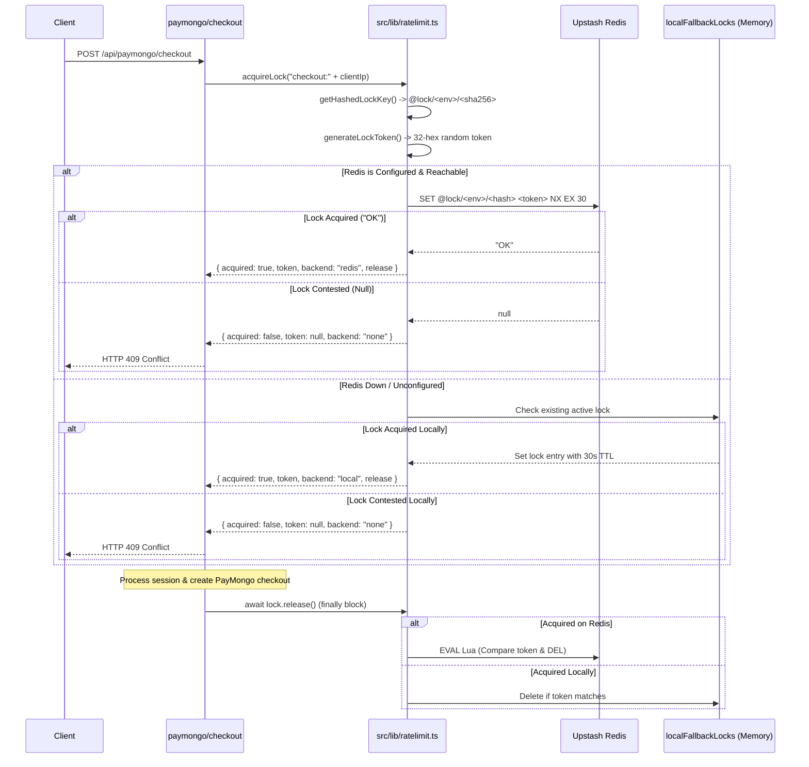

# GovStudyX — Rate Limit Module Consolidation
## Phase R6A — Read-Only Discovery & Architecture Audit

---

### 1. Executive Conclusion

```
SAFE_WITH_COMPATIBILITY_LAYER
```

**Rationale:**
Consolidation of the rate-limiting and locking infrastructure under `src/lib/ratelimit.ts` as the canonical implementation is completely safe and architecturally recommended. However, `src/lib/rate-limit.ts` **must remain as a thin backward-compatibility layer** re-exporting canonical primitives. Direct outright deletion of `src/lib/rate-limit.ts` would cause an immediate regression:
1. `src/scripts/test-readiness-slice-r1b.ts` contains hard assertions in **Test Group 9 (Compatibility Layer)** that inspect `src/lib/rate-limit.ts` via `fs.readFileSync` for specific string signatures (`acquireDistributedLock`, `releaseDistributedLock`, `export async function acquireLock`, `export async function releaseLock`, `export function checkRateLimit`, `export function getClientIp`) and invokes `compatAcquireLock` / `compatReleaseLock`.
2. `src/app/api/paymongo/checkout/route.ts` still imports `acquireLock`, `releaseLock`, and `getClientIp` from `@/lib/rate-limit`.
3. 25 of the remaining 28 callers across the codebase already import directly from canonical `src/lib/ratelimit.ts`.
4. The lock primitives in `src/lib/rate-limit.ts` already wrap `acquireDistributedLock` and `releaseDistributedLock` from `src/lib/ratelimit.ts`.
5. Retaining `src/lib/rate-limit.ts` as a thin proxy maintains 100% backward compatibility, prevents test breakage, and guarantees zero runtime risk.

---

### 2. Current Branch & Baseline Verification

- **Repository / Worktree Root:** `C:\Users\Administrator\govstudyx-ratelimit-cleanup`
- **Active Branch:** `cleanup/rate-limit-consolidation`
- **Current HEAD Commit:** `a024ceae1cea430850099f61c406419a7e0481d7`
- **Expected Baseline Commit:** `a024ceae1cea430850099f61c406419a7e0481d7`
- **Working Tree Status:** Clean (`nothing to commit, working tree clean`).
- **Baseline Verification:**
  - Includes completed Post-Launch Readiness Hardening (`93e9e06`, `5da214a`).
  - Includes completed Performance Slice 4 Cache Architecture and Content Integrity Hardening (`a024cea`, `59fe943`, `9cf9698`, `068a3e1`).
  - Verification confirmed: Zero Performance Slice 4 or readiness features are modified, bypassed, or reverted.

---

### 3. Canonical-Module Recommendation

**Canonical Module:** `src/lib/ratelimit.ts`
**Compatibility Layer:** `src/lib/rate-limit.ts` (re-exports from canonical)

**Detailed Justification:**
1. **Feature Completeness:** `src/lib/ratelimit.ts` contains all 11 Upstash Redis sliding-window limiters (`AUTH_LIMITER`, `EXAM_SUBMIT_LIMITER`, `MESSAGING_LIMITER`, `AI_EXPLAIN_LIMITER`, `PAYMONGO_CHECKOUT_LIMITER`, `PAYMONGO_VERIFY_LIMITER`, `VOICE_TOKEN_LIMITER`, `SUPPORT_TICKET_LIMITER`, `AI_GENERATE_LIMITER`, `EXAM_START_LIMITER`, `SUDO_LIMITER`).
2. **Distributed Concurrency Locking:** `src/lib/ratelimit.ts` implements the production-grade distributed concurrency lock using Redis `SET NX EX`, SHA-256 key hashing (`@lock/${env}/${digest}`), cryptographically random 32-hex owner tokens, Lua atomic compare-and-delete release, and process-local fallback (`localFallbackLocks`) with backend-affine release handles.
3. **Ergonomic Aliases Already Present:** Lines 333–334 of `src/lib/ratelimit.ts` already export:
   ```typescript
   export const acquireLock = acquireDistributedLock;
   export const releaseLock = releaseDistributedLock;
   ```
4. **Dominant Caller Adoption:** Over 89% of all rate-limiting call sites in the repository (25 of 28 files) already import directly from `@/lib/ratelimit`.
5. **Existing Delegation:** `src/lib/rate-limit.ts` already imports from `@/lib/ratelimit` for its lock operations (`acquireDistributedLock`, `releaseDistributedLock`, `LockResult`).

---

### 4. Full Export Comparison Table

| Symbol | Current Module | Classification | Current Callers | Runtime Role | Must Preserve? | Recommended Final Location | Reason |
| :--- | :--- | :--- | :--- | :--- | :--- | :--- | :--- |
| `AUTH_LIMITER` | `src/lib/ratelimit.ts` | `CANONICAL` / `MUST_PRESERVE` | 12 routes (auth, partner, referral) | Upstash sliding window (5 req / 10s) protecting auth endpoints | YES | `src/lib/ratelimit.ts` | Primary security limiter against brute force |
| `EXAM_SUBMIT_LIMITER` | `src/lib/ratelimit.ts` | `CANONICAL` / `MUST_PRESERVE` | `exam/submit/route.ts`, `test-p0-002-b1.ts` | Sliding window (10 req / 1m) bounding quiz grading submissions | YES | `src/lib/ratelimit.ts` | Protects database grading and streak transactions |
| `MESSAGING_LIMITER` | `src/lib/ratelimit.ts` | `CANONICAL` / `MUST_PRESERVE` | `social/messages/.../route.ts`, `test-p0-002-b1.ts` | Sliding window (20 req / 1m) bounding chat messages | YES | `src/lib/ratelimit.ts` | Prevents chat spam |
| `AI_EXPLAIN_LIMITER` | `src/lib/ratelimit.ts` | `CANONICAL` / `MUST_PRESERVE` | `ai/explain-mistake/route.ts` | Sliding window (15 req / 1m) bounding LLM mistake analysis | YES | `src/lib/ratelimit.ts` | Protects external LLM quota and cost |
| `PAYMONGO_CHECKOUT_LIMITER` | `src/lib/ratelimit.ts` | `CANONICAL` / `MUST_PRESERVE` | `paymongo/checkout/route.ts` | Sliding window (3 req / 1m per user) bounding checkout sessions | YES | `src/lib/ratelimit.ts` | Prevents checkout session flooding |
| `PAYMONGO_VERIFY_LIMITER` | `src/lib/ratelimit.ts` | `CANONICAL` / `MUST_PRESERVE` | `paymongo/verify/route.ts` | Sliding window (20 req / 1m) bounding payment status checks | YES | `src/lib/ratelimit.ts` | Protects payment verification endpoint against polling loops |
| `VOICE_TOKEN_LIMITER` | `src/lib/ratelimit.ts` | `CANONICAL` / `MUST_PRESERVE` | `voice-token/route.ts`, `test-p0-002-b1.ts` | Sliding window (10 req / 1m) bounding LiveKit room token minting | YES | `src/lib/ratelimit.ts` | Protects LiveKit WebRTC credentials and tokens |
| `SUPPORT_TICKET_LIMITER` | `src/lib/ratelimit.ts` | `CANONICAL` / `MUST_PRESERVE` | `support/route.ts` | Sliding window (3 req / 10m) bounding customer support submissions | YES | `src/lib/ratelimit.ts` | Prevents ticket flooding and support email spam |
| `AI_GENERATE_LIMITER` | `src/lib/ratelimit.ts` | `CANONICAL` / `MUST_PRESERVE` | `ai-generate/route.ts`, `test-readiness-slice-r1a.ts` | Sliding window (5 req / 1m per admin) bounding Gemini question generation | YES | `src/lib/ratelimit.ts` | Protects Gemini generation API quotas |
| `EXAM_START_LIMITER` | `src/lib/ratelimit.ts` | `CANONICAL` / `MUST_PRESERVE` | `exam/start/route.ts`, `test-readiness-slice-r1a.ts` | Sliding window (10 req / 1m per user) bounding quiz generation | YES | `src/lib/ratelimit.ts` | Protects database from rapid quiz generation loops |
| `SUDO_LIMITER` | `src/lib/ratelimit.ts` | `CANONICAL` / `MUST_PRESERVE` | `sudoMode.ts`, `test-readiness-slice-r1b.ts` | Sliding window (3 req / 1m) protecting admin password elevation | YES | `src/lib/ratelimit.ts` | Core security protection for sudo mode |
| `RateLimitCheckResult` (type) | `src/lib/ratelimit.ts` | `CANONICAL` / `MUST_PRESERVE` | Route handlers, `checkRateLimit`, `createRateLimitResponse` | Result contract `{ success, limit, remaining, reset }` | YES | `src/lib/ratelimit.ts` | Canonical interface for rate checking |
| `checkRateLimit` (async) | `src/lib/ratelimit.ts` | `CANONICAL` / `MUST_PRESERVE` | 17+ API route handlers | Executes Upstash check with fail-open fallback on error | YES | `src/lib/ratelimit.ts` | Primary rate-checking function |
| `getClientIp` | `src/lib/ratelimit.ts` | `CANONICAL` / `MUST_PRESERVE` | 13 API routes | Header extraction (`x-forwarded-for` / `x-real-ip` / fallback) | YES | `src/lib/ratelimit.ts` | Canonical client IP extraction utility |
| `createRateLimitResponse` | `src/lib/ratelimit.ts` | `CANONICAL` / `MUST_PRESERVE` | All rate-limited API routes | Standardized HTTP 429 response builder with RFC headers | YES | `src/lib/ratelimit.ts` | Standardized error response factory |
| `LockResult` (type) | `src/lib/ratelimit.ts` | `CANONICAL` / `MUST_PRESERVE` | `rate-limit.ts`, `checkout/route.ts`, tests | Return shape `{ acquired, token, release, backend }` | YES | `src/lib/ratelimit.ts` | Canonical lock return interface |
| `getHashedLockKey` | `src/lib/ratelimit.ts` | `CANONICAL` / `MUST_PRESERVE` | `test-readiness-slice-r1b.ts`, internal lock methods | Produces `@lock/${env}/${sha256(rawKey).slice(0, 32)}` | YES | `src/lib/ratelimit.ts` | Eliminates raw identifier / PII leakage |
| `generateLockToken` | `src/lib/ratelimit.ts` | `CANONICAL` / `MUST_PRESERVE` | `test-readiness-slice-r1b.ts`, internal `acquireDistributedLock` | Generates cryptographically random 32-hex owner token | YES | `src/lib/ratelimit.ts` | Ensures unique lock ownership |
| `FallbackLockEntry` (type) | `src/lib/ratelimit.ts` | `CANONICAL` / `MUST_PRESERVE` | `localFallbackLocks` map | In-memory fallback lock entry `{ token, expiresAt }` | YES | `src/lib/ratelimit.ts` | Shape for process-local lock entries |
| `localFallbackLocks` | `src/lib/ratelimit.ts` | `CANONICAL` / `MUST_PRESERVE` | `test-readiness-slice-r1b.ts`, internal lock methods | `Map<string, FallbackLockEntry>` for process-local fallback | YES | `src/lib/ratelimit.ts` | Provides local mutual exclusion during Redis outage |
| `releaseRedisLock` | `src/lib/ratelimit.ts` | `CANONICAL` / `MUST_PRESERVE` | `test-readiness-slice-r1b.ts`, internal affine release | Atomic Lua compare-and-delete on Redis | YES | `src/lib/ratelimit.ts` | Protects against stale-owner lock deletion |
| `releaseLocalFallbackLock` | `src/lib/ratelimit.ts` | `CANONICAL` / `MUST_PRESERVE` | `test-readiness-slice-r1b.ts`, internal affine release | Token-matching release on `localFallbackLocks` | YES | `src/lib/ratelimit.ts` | Protects against stale-owner fallback release |
| `acquireDistributedLock` | `src/lib/ratelimit.ts` | `CANONICAL` / `MUST_PRESERVE` | `test-readiness-slice-r1b.ts`, `rate-limit.ts`, `acquireLock` | Attempts Redis SET NX EX; falls back to local memory | YES | `src/lib/ratelimit.ts` | Canonical distributed lock primitive |
| `releaseDistributedLock` | `src/lib/ratelimit.ts` | `CANONICAL` / `MUST_PRESERVE` | `test-readiness-slice-r1b.ts`, `rate-limit.ts`, `releaseLock` | Dual release dispatcher attempting Redis and local fallback | YES | `src/lib/ratelimit.ts` | Non-affine lock release fallback helper |
| `acquireLock` (alias) | `src/lib/ratelimit.ts` | `CANONICAL` / `MUST_PRESERVE` | Canonical alias for `acquireDistributedLock` | Ergonomic alias exported directly from `ratelimit.ts` | YES | `src/lib/ratelimit.ts` | Standard public locking API |
| `releaseLock` (alias) | `src/lib/ratelimit.ts` | `CANONICAL` / `MUST_PRESERVE` | Canonical alias for `releaseDistributedLock` | Ergonomic alias exported directly from `ratelimit.ts` | YES | `src/lib/ratelimit.ts` | Standard public locking API |
| `LockResult` (re-export) | `src/lib/rate-limit.ts` | `LEGACY_COMPATIBILITY` / `MUST_PRESERVE` | Re-exported from `@/lib/ratelimit` | Type compatibility for legacy callers | YES | Re-export in `src/lib/rate-limit.ts` | Backward compatibility |
| `acquireLock` | `src/lib/rate-limit.ts` | `LEGACY_COMPATIBILITY` / `MUST_PRESERVE` | `paymongo/checkout/route.ts`, `test-readiness-slice-r1b.ts` | Calls `acquireDistributedLock(key, ttlSeconds)` | YES | Re-export in `src/lib/rate-limit.ts` | Required by `test-readiness-slice-r1b.ts` Group 9 |
| `releaseLock` | `src/lib/rate-limit.ts` | `LEGACY_COMPATIBILITY` / `MUST_PRESERVE` | `paymongo/checkout/route.ts` (imported), `test-readiness-slice-r1b.ts` | Calls `releaseDistributedLock(key, token ?? null)` | YES | Re-export in `src/lib/rate-limit.ts` | Required by `test-readiness-slice-r1b.ts` Group 9 |
| `getClientIp` | `src/lib/rate-limit.ts` | `DUPLICATE` / `LEGACY_COMPATIBILITY` / `MUST_PRESERVE` | `paymongo/checkout/route.ts`, `test-readiness-slice-r1b.ts` | Header extraction (identical logic to canonical) | YES | Re-export in `src/lib/rate-limit.ts` | Required by `test-readiness-slice-r1b.ts` Group 9 |
| `checkRateLimit` (sync) | `src/lib/rate-limit.ts` | `LEGACY_COMPATIBILITY` / `MUST_PRESERVE` | Asserted in `test-readiness-slice-r1b.ts` (0 route callers) | Synchronous memory-based sliding window | YES | Preserved in `src/lib/rate-limit.ts` | Required by `test-readiness-slice-r1b.ts` Group 9 |
| `rateLimitMap` | `src/lib/rate-limit.ts` | `UNUSED` / `LEGACY_COMPATIBILITY` | Internal to `src/lib/rate-limit.ts` | In-memory map for legacy `checkRateLimit` | YES (internal) | Internal in `src/lib/rate-limit.ts` | Backs legacy `checkRateLimit` |
| `cleanupTimer` | `src/lib/rate-limit.ts` | `UNUSED` / `LEGACY_COMPATIBILITY` | Internal to `src/lib/rate-limit.ts` | 5-minute interval timer cleaning `rateLimitMap` | OPTIONAL | Internal in `src/lib/rate-limit.ts` | Periodic timer cleaning legacy map |

---

### 5. Complete Caller & Import Inventory

Every file in the repository importing from `@/lib/rate-limit`, `@/lib/ratelimit`, or relative equivalents:

| # | Caller File | Imported Module | Imported Symbols | Server / Client | Runtime Critical? | Migration Needed? | Notes |
| :- | :--- | :--- | :--- | :--- | :--- | :--- | :--- |
| 1 | `src/app/api/paymongo/checkout/route.ts` | `@/lib/rate-limit` | `acquireLock`, `releaseLock`, `getClientIp` | Server (Route Handler - POST) | **CRITICAL** | **YES (Recommended in R6B)** | Also imports `PAYMONGO_CHECKOUT_LIMITER`, `checkRateLimit`, `createRateLimitResponse` from `@/lib/ratelimit`. In R6B, unify all imports to `@/lib/ratelimit`. Note: `releaseLock` is imported but unused (releases via `await lock.release()`). |
| 2 | `src/app/api/paymongo/checkout/route.ts` | `@/lib/ratelimit` | `PAYMONGO_CHECKOUT_LIMITER`, `checkRateLimit`, `createRateLimitResponse` | Server (Route Handler - POST) | **CRITICAL** | NO | Limits user checkouts to 3 req / 1m. |
| 3 | `src/scripts/test-readiness-slice-r1b.ts` | `../lib/rate-limit` | `acquireLock as compatAcquireLock`, `releaseLock as compatReleaseLock` | Server (CLI Test Script) | **CRITICAL** | **NO** | Explicitly tests the compatibility layer in Test Group 9. Must continue importing `../lib/rate-limit`. |
| 4 | `src/scripts/test-readiness-slice-r1b.ts` | `../lib/ratelimit` | `SUDO_LIMITER`, `getHashedLockKey`, `generateLockToken`, `acquireDistributedLock`, `releaseDistributedLock`, `releaseRedisLock`, `releaseLocalFallbackLock`, `localFallbackLocks` | Server (CLI Test Script) | **CRITICAL** | NO | Verifies sudo limiter, lock hashing, tokens, affine release, and fallback. |
| 5 | `src/lib/rate-limit.ts` | `@/lib/ratelimit` | `acquireDistributedLock`, `releaseDistributedLock`, `LockResult` | Server (Lib Module) | HIGH | NO | Current compatibility layer importing from canonical. |
| 6 | `src/lib/auth/sudoMode.ts` | `@/lib/ratelimit` | `SUDO_LIMITER` | Server (Auth Helper) | **CRITICAL** | NO | Sudo password elevation rate limiting (3 req / 1m) with local fallback. |
| 7 | `src/scripts/test-readiness-slice-r1a.ts` | `../lib/ratelimit` | `AI_GENERATE_LIMITER`, `EXAM_START_LIMITER` | Server (CLI Test Script) | HIGH | NO | Validates AI generate and exam start limiter configurations and route integrations. |
| 8 | `src/app/api/auth/login/route.ts` | `@/lib/ratelimit` | `AUTH_LIMITER`, `checkRateLimit`, `getClientIp`, `createRateLimitResponse` | Server (Route Handler - POST) | **CRITICAL** | NO | Scoped by `login:${clientIp}`. |
| 9 | `src/app/api/auth/register/route.ts` | `@/lib/ratelimit` | `AUTH_LIMITER`, `checkRateLimit`, `getClientIp`, `createRateLimitResponse` | Server (Route Handler - POST) | **CRITICAL** | NO | Scoped by `register:${clientIp}`. |
| 10 | `src/app/api/auth/signup/route.ts` | `@/lib/ratelimit` | `AUTH_LIMITER`, `checkRateLimit`, `getClientIp`, `createRateLimitResponse` | Server (Route Handler - POST) | **CRITICAL** | NO | Scoped by `signup:${clientIp}`. |
| 11 | `src/app/api/auth/forgot-password/route.ts` | `@/lib/ratelimit` | `AUTH_LIMITER`, `checkRateLimit`, `getClientIp`, `createRateLimitResponse` | Server (Route Handler - POST) | **CRITICAL** | NO | Scoped by `forgot-password:${clientIp}`. |
| 12 | `src/app/api/auth/reset-password/route.ts` | `@/lib/ratelimit` | `AUTH_LIMITER`, `checkRateLimit`, `getClientIp`, `createRateLimitResponse` | Server (Route Handler - POST) | **CRITICAL** | NO | Scoped by `reset-password:${clientIp}`. |
| 13 | `src/app/api/auth/resend-verification/route.ts` | `@/lib/ratelimit` | `AUTH_LIMITER`, `checkRateLimit`, `getClientIp`, `createRateLimitResponse` | Server (Route Handler - POST) | **CRITICAL** | NO | Scoped by `resend-verification:${clientIp}`. |
| 14 | `src/app/api/partner/apply/route.ts` | `@/lib/ratelimit` | `AUTH_LIMITER`, `checkRateLimit`, `getClientIp`, `createRateLimitResponse` | Server (Route Handler - POST) | HIGH | NO | Scoped by `partner-apply:${clientIp}`. |
| 15 | `src/app/api/partner/auth/login/route.ts` | `@/lib/ratelimit` | `AUTH_LIMITER`, `checkRateLimit`, `getClientIp`, `createRateLimitResponse` | Server (Route Handler - POST) | **CRITICAL** | NO | Scoped by `partner-login:${clientIp}`. |
| 16 | `src/app/api/partner/auth/forgot-password/route.ts` | `@/lib/ratelimit` | `AUTH_LIMITER`, `checkRateLimit`, `getClientIp`, `createRateLimitResponse` | Server (Route Handler - POST) | **CRITICAL** | NO | Scoped by `partner-forgot-password:${clientIp}`. |
| 17 | `src/app/api/partner/auth/reset-password/route.ts` | `@/lib/ratelimit` | `AUTH_LIMITER`, `checkRateLimit`, `getClientIp`, `createRateLimitResponse` | Server (Route Handler - POST) | **CRITICAL** | NO | Scoped by `partner-reset-password:${clientIp}`. |
| 18 | `src/app/api/partner/auth/setup/route.ts` | `@/lib/ratelimit` | `AUTH_LIMITER`, `checkRateLimit`, `getClientIp`, `createRateLimitResponse` | Server (Route Handler - GET, POST) | **CRITICAL** | NO | Scoped by `partner-setup:${clientIp}` on GET & POST. |
| 19 | `src/app/api/referral/payout/route.ts` | `@/lib/ratelimit` | `AUTH_LIMITER`, `checkRateLimit`, `getClientIp`, `createRateLimitResponse` | Server (Route Handler - POST) | **CRITICAL** | NO | Scoped by `payout:${clientIp}`. |
| 20 | `src/app/api/exam/start/route.ts` | `@/lib/ratelimit` | `EXAM_START_LIMITER`, `checkRateLimit`, `createRateLimitResponse` | Server (Route Handler - POST) | HIGH | NO | Scoped by `exam:start:${userId}`. |
| 21 | `src/app/api/exam/submit/route.ts` | `@/lib/ratelimit` | `EXAM_SUBMIT_LIMITER`, `checkRateLimit`, `createRateLimitResponse` | Server (Route Handler - POST) | HIGH | NO | Scoped by `exam_submit:${userId}`. |
| 22 | `src/app/api/admin/questions/ai-generate/route.ts` | `@/lib/ratelimit` | `AI_GENERATE_LIMITER`, `checkRateLimit`, `createRateLimitResponse` | Server (Route Handler - POST) | HIGH | NO | Scoped by `admin:ai-generate:${userId}`. |
| 23 | `src/app/api/ai/explain-mistake/route.ts` | `@/lib/ratelimit` | `AI_EXPLAIN_LIMITER`, `checkRateLimit`, `createRateLimitResponse` | Server (Route Handler - POST) | HIGH | NO | Scoped by `ai:explain-mistake:${userId}`. |
| 24 | `src/app/api/social/messages/[conversationId]/route.ts` | `@/lib/ratelimit` | `MESSAGING_LIMITER`, `checkRateLimit`, `createRateLimitResponse` | Server (Route Handler - POST) | MEDIUM | NO | Scoped by `msg:${userId}`. |
| 25 | `src/app/api/social/rooms/[roomId]/voice-token/route.ts` | `@/lib/ratelimit` | `VOICE_TOKEN_LIMITER`, `checkRateLimit`, `createRateLimitResponse` | Server (Route Handler - GET) | HIGH | NO | Scoped by `voice-token:${userId}`. |
| 26 | `src/app/api/support/route.ts` | `@/lib/ratelimit` | `SUPPORT_TICKET_LIMITER`, `checkRateLimit`, `createRateLimitResponse` | Server (Route Handler - POST) | MEDIUM | NO | Scoped by `support:${clientIp}`. |
| 27 | `src/app/api/paymongo/verify/route.ts` | `@/lib/ratelimit` | `PAYMONGO_VERIFY_LIMITER`, `checkRateLimit`, `createRateLimitResponse` | Server (Route Handler - POST) | **CRITICAL** | NO | Scoped by `paymongo:verify:${userId}`. |
| 28 | `src/app/api/admin/referrals/[id]/route.ts` | `@/lib/ratelimit` | `getClientIp` | Server (Route Handler - PATCH) | HIGH | NO | Client IP extraction for audit logging. |
| 29 | `src/app/api/admin/referrals/settings/route.ts` | `@/lib/ratelimit` | `getClientIp` | Server (Route Handler - PUT) | HIGH | NO | Client IP extraction for audit logging. |
| 30 | `src/app/api/admin/referrals/payouts/route.ts` | `@/lib/ratelimit` | `getClientIp` | Server (Route Handler - POST) | HIGH | NO | Client IP extraction for audit logging. |

---

### 6. Runtime Behavior Comparison

| Dimension | `src/lib/ratelimit.ts` (Canonical) | `src/lib/rate-limit.ts` (Legacy / Wrapper) | Divergence / Risk |
| :--- | :--- | :--- | :--- |
| **1. Rate-Limit Algorithm** | `@upstash/ratelimit` sliding window across distributed cluster. | Synchronous sliding/fixed window in local memory (`rateLimitMap`). | **High divergence in logic**, but `src/lib/rate-limit.ts`'s `checkRateLimit` has **0 live route callers**. |
| **2. Redis Usage** | Direct `@upstash/redis` connection (`SET NX EX`, Lua script eval, Ratelimit instances). | None directly. Relies on `ratelimit.ts` for locking. | Zero risk. |
| **3. Key Generation** | Prefixes with `@ratelimit/<env>/...` and `@lock/<env>/...`. | Raw key string for memory limiter; passes raw key to `ratelimit.ts` for locks. | Zero risk. |
| **4. Identifier Hashing** | SHA-256 digest truncated to 32 hex chars for locks (`getHashedLockKey`). Sudo mode hashes identifier with SHA-256. | None internally. Passes keys to `ratelimit.ts`. | Zero risk. |
| **5. Time Windows** | Varies by limiter (10s, 1m, 10m). Exact sliding window. | Default 60,000 ms in function signature. | Zero risk. |
| **6. Request Limits** | Explicitly tuned per limiter (3, 5, 10, 15, 20). | Default `maxRequests = 3` in function signature. | Zero risk. |
| **7. Failure / Fallback** | Rate limits: Fail-open with warning. Locks: Fall back to `localFallbackLocks`. | Rate limits: In-memory only (no Redis fallback needed). Locks: Delegated to `ratelimit.ts`. | Zero risk. |
| **8. Local In-Memory State** | `localFallbackLocks` (Map) for lock fallback. | `rateLimitMap` (Map) + 5m `setInterval` cleanup timer. | Two distinct maps exist. `rateLimitMap` is completely unpopulated in production. |
| **9. Lock Ownership** | 32-hex cryptographically random owner tokens (`crypto.randomBytes(16)`). | Delegated to `ratelimit.ts`. | Identical. |
| **10. Lock Expiration** | Configurable TTL (default 30 seconds) in Redis and local fallback. | Configurable TTL (default 30 seconds) forwarded to `ratelimit.ts`. | Identical. |
| **11. Token Generation** | `generateLockToken()` in `ratelimit.ts`. | Delegated to `ratelimit.ts`. | Identical. |
| **12. Lock Release Behavior** | Dual path: Lua compare-and-delete on Redis + token check on local fallback. Backend-affine release handles returned on lock object. | Delegated to `releaseDistributedLock` in `ratelimit.ts`. | Identical. |
| **13. Error Handling** | Try/catch around Redis network calls with structured warnings. | Try/catch in delegated `ratelimit.ts` methods. | Identical. |
| **14. Client-IP Derivation** | Header extraction: `x-forwarded-for` (first entry) -> `x-real-ip` -> `127.0.0.1`. | Header extraction: `x-forwarded-for` (first entry) -> `x-real-ip` -> `127.0.0.1`. | **Byte-for-byte identical**. |
| **15. Production vs Dev** | Namespaced via `rateLimitEnvironment` (`VERCEL_ENV` \|\| `NODE_ENV` \|\| `"development"`). | None. | Zero risk. |
| **16. Fail-Open / Fail-Closed** | Rate limits: fail-open. Sudo: local memory (fail-closed after 3). Locks: local fallback (mutual exclusion preserved). Refund execution: fail-closed. | `rate-limit.ts` locking delegates to `ratelimit.ts`. | Identical. |

---

### 7. Redis Behavior Comparison

1. **Client Instantiation:**
   - `src/lib/ratelimit.ts` checks `UPSTASH_REDIS_REST_URL` and `UPSTASH_REDIS_REST_TOKEN`. If present, creates a single `new Redis(...)` instance. If absent, `redis = null`.
   - `src/lib/rate-limit.ts` does **not** instantiate Redis. It uses the singleton instance managed inside `src/lib/ratelimit.ts`.
2. **Operations Performed:**
   - Sliding-window rate check via `@upstash/ratelimit` script.
   - Atomic lock acquisition via `redis.set(hashedKey, token, { nx: true, ex: ttlSeconds })`.
   - Atomic lock release via `redis.eval(RELEASE_LOCK_LUA, [hashedKey], [token])`.
3. **Fail-Open vs Fail-Closed Semantics:**
   - Standard API endpoints: Fail-open. If Redis throws a network error or is unconfigured, `checkRateLimit` catches the error, logs `[RATELIMIT_FAIL_OPEN_WARNING]`, and returns `{ success: true, limit: 0, remaining: 0, reset: 0 }`.
   - Sudo elevation (`sudoMode.ts`): Does **not** fail open. If Redis is unavailable, it catches the error and falls back to local in-memory attempt tracking (`attemptTracker`), enforcing a strict 3-attempt ceiling.
   - Distributed concurrency lock: Does **not** fail open. If Redis is unavailable, it falls back to process-local locking in `localFallbackLocks`, still rejecting concurrent in-flight requests.
   - Refund execution (`refundExecutionSecurityContract.ts`): Strictly fail-closed.

---

### 8. Local Fallback & State Duplication Check

| In-Memory State Container | Location | Purpose | Populated in Production? | Potential Conflict |
| :--- | :--- | :--- | :--- | :--- |
| `localFallbackLocks` | `src/lib/ratelimit.ts` | Fallback concurrency lock table (`Map<string, FallbackLockEntry>`) | Only when Redis is unavailable | **None.** Both `ratelimit.ts` and `rate-limit.ts` operate on this exact same instance because `rate-limit.ts` imports the lock functions from `ratelimit.ts`. |
| `rateLimitMap` | `src/lib/rate-limit.ts` | Legacy in-memory rate limit store (`Map<string, RateLimitRecord>`) | **NO.** 0 production routes call `rate-limit.ts`'s `checkRateLimit`. | **None.** It is completely unpopulated at runtime. |
| `cleanupTimer` | `src/lib/rate-limit.ts` | 5-minute unref'd `setInterval` clearing expired entries from `rateLimitMap` | Runs periodically in Node.js background | Minor resource overhead (periodic wake-up for an empty map). |
| `attemptTracker` | `src/lib/auth/sudoMode.ts` | Fallback attempt store for sudo mode (`Map<string, { count, resetAt }>`) | Only when Redis is unavailable | Isolated strictly to sudo mode. |

**State Duplication Conclusion:**
There is **zero concurrency split-brain** between the two modules. The locking state is already completely centralized in `src/lib/ratelimit.ts`.

---

### 9. Lock Coordination Analysis



**Key Invariants:**
1. **Request-Scoped Ownership:** Locks use cryptographically random 32-hex tokens (`generateLockToken()`), preventing accidental release by other processes.
2. **Backend-Affine Release:** `acquireLock` returns `{ acquired, token, backend, release: () => Promise<boolean> }`. Calling `await lock.release()` dispatches strictly to the backend that granted the lock.
3. **Owner-Safe Release (Stale Lock Protection):**
   - Redis release uses Lua script `RELEASE_LOCK_LUA` which evaluates `if redis.call("get", KEYS[1]) == ARGV[1] then return redis.call("del", KEYS[1]) else return 0 end`.
   - Local fallback release verifies `existing.token === token` before deleting.
   - If a transaction takes longer than 30s and a second request acquires the lock, the first request will **never** delete the second request's lock.

---

### 10. PayMongo Checkout Dependency Analysis

- **Route:** `src/app/api/paymongo/checkout/route.ts`
- **Current Imports:**
  ```typescript
  // Line 6:
  import { acquireLock, releaseLock, getClientIp } from "@/lib/rate-limit";
  // Line 8-12:
  import {
    PAYMONGO_CHECKOUT_LIMITER,
    checkRateLimit,
    createRateLimitResponse,
  } from "@/lib/ratelimit";
  ```
- **Runtime Flow:**
  1. `clientIp = getClientIp(request)`
  2. `lock = await acquireLock("checkout:" + clientIp)`
  3. If `!lock.acquired`, returns `HTTP 409 { error: "A payment transaction is already processing. Please wait..." }`.
  4. Authenticates user session (`userId = authResult.session.user.id`).
  5. Checks user checkout rate limit: `checkRateLimit(PAYMONGO_CHECKOUT_LIMITER, "paymongo:checkout:" + userId)`.
  6. In `finally` block: `await lock.release()`.
- **Payment Safety Authority:**
  - Upstash Redis is **NOT** the financial authority.
  - PostgreSQL remains the exclusive source of truth for payment status, ledger records, financial idempotency keys, and user plan entitlements.
  - The checkout lock serves purely as an in-flight debounce guard protecting against concurrent double-clicks and network race conditions.
- **Impact of Consolidation:**
  - If `paymongo/checkout/route.ts` imports `acquireLock, getClientIp` directly from `@/lib/ratelimit`, the runtime behavior is **100% identical** because `rate-limit.ts` was already forwarding to `ratelimit.ts`.
  - The dormant durable payment-finalization architecture is completely untouched.

---

### 11. Sudo Mode Analysis

- **File:** `src/lib/auth/sudoMode.ts`
- **Dependencies:**
  ```typescript
  import { SUDO_LIMITER } from "@/lib/ratelimit";
  ```
- **Invariants Verified:**
  - Limit: Strictly 3 attempts per 1 minute (`"1 m"`).
  - Identifier Hashing: The raw identifier (`${ip}:${userId}`) is hashed using SHA-256 and truncated to 32 hex characters (`crypto.createHash("sha256").update(identifier).digest("hex").slice(0, 32)`).
  - Distributed Behavior: When Upstash Redis is active, `SUDO_LIMITER.limit(hashedIdentifier)` coordinates across server instances.
  - Local Fallback: If Redis is unavailable, it falls back to `attemptTracker: Map<string, { count, resetAt }>` in memory, enforcing max 3 attempts per 60,000 ms.
  - Zero PII Exposure: Neither Redis keys nor memory keys contain raw IP addresses or user IDs.
- **Impact of Consolidation:** Zero. `sudoMode.ts` already imports from `@/lib/ratelimit`.

---

### 12. AI Limiter Dependency Analysis

- **Route:** `src/app/api/admin/questions/ai-generate/route.ts`
- **Limiter Definition:** `AI_GENERATE_LIMITER = createLimiter(5, "1 m", "@ratelimit/${rateLimitEnvironment}/ai_generate")` in `src/lib/ratelimit.ts`.
- **Calling Contract:**
  ```typescript
  const rateLimitKey = `admin:ai-generate:${authentication.session.user.id}`;
  const rateResult = await checkRateLimit(AI_GENERATE_LIMITER, rateLimitKey);
  if (!rateResult.success) {
    return createRateLimitResponse(rateResult, "AI question generation rate limit exceeded...");
  }
  ```
- **Verification in Test Suite:** Verified in `src/scripts/test-readiness-slice-r1a.ts` Test Group 2.
- **Impact of Consolidation:** Zero. Already canonical in `src/lib/ratelimit.ts`.

---

### 13. Exam-Start Limiter Dependency Analysis

- **Route:** `src/app/api/exam/start/route.ts`
- **Limiter Definition:** `EXAM_START_LIMITER = createLimiter(10, "1 m", "@ratelimit/${rateLimitEnvironment}/exam_start")` in `src/lib/ratelimit.ts`.
- **Calling Contract:**
  ```typescript
  const rateLimitKey = `exam:start:${userId}`;
  const rateResult = await checkRateLimit(EXAM_START_LIMITER, rateLimitKey);
  if (!rateResult.success) {
    return createRateLimitResponse(rateResult, "Too many exam start attempts...");
  }
  ```
- **Verification in Test Suite:** Verified in `src/scripts/test-readiness-slice-r1a.ts` Test Group 3.
- **Impact of Consolidation:** Zero. Already canonical in `src/lib/ratelimit.ts`.

---

### 14. Client / Server Boundary Assessment

- **Node.js Built-ins Used:** `crypto`, `process.env`.
- **Server Packages Used:** `@upstash/redis`, `@upstash/ratelimit`, `next/server`.
- **Client Component Verification:**
  - Neither `src/lib/ratelimit.ts` nor `src/lib/rate-limit.ts` has `"use client"`.
  - Neither module is imported by any file in `src/components/**` or any `"use client"` page.
  - All callers are server-side Next.js Route Handlers (`src/app/api/**`), server libraries (`src/lib/**`), middleware helpers (`src/middleware/**`), or CLI scripts (`src/scripts/**`).
- **Boundary Violation Risk:** **ZERO.**

---

### 15. Circular Dependency Assessment

Dependency graph:
```
src/app/api/** ──> src/lib/ratelimit.ts ──> @upstash/redis, @upstash/ratelimit, crypto, src/lib/cache.ts
                         ▲
                         │ (re-exports)
                 src/lib/rate-limit.ts
```
- `src/lib/cache.ts` imports only `NextResponse` from `next/server`.
- Neither `src/lib/ratelimit.ts` nor `src/lib/rate-limit.ts` imports any route handler, auth service, database client, or payment service.
- **Circular Dependency Risk:** **ZERO.**

---

### 16. Test Dependency Inventory

The automated test suites in `src/scripts/` have specific dependencies on these modules:

1. **`src/scripts/test-readiness-slice-r1b.ts`**:
   - **Group 1:** Asserts `SUDO_LIMITER` in `src/lib/ratelimit.ts` with `3` requests / `"1 m"`.
   - **Group 4 & 5:** Asserts `getHashedLockKey`, `generateLockToken`, `acquireDistributedLock` from `src/lib/ratelimit.ts`.
   - **Group 6 & 7:** Asserts `releaseRedisLock`, `releaseLocalFallbackLock`, `localFallbackLocks` from `src/lib/ratelimit.ts`.
   - **Group 8:** Asserts `paymongo/checkout/route.ts` contains `const lock = await acquireLock(lockKey)`, `status: 409`, and `await lock.release()`.
   - **Group 9 (CRITICAL):**
     ```typescript
     // Reads src/lib/rate-limit.ts as text:
     assert(rateLimitCompatSource.includes("acquireDistributedLock") &&
            rateLimitCompatSource.includes("releaseDistributedLock"));
     assert(rateLimitCompatSource.includes("export async function acquireLock") &&
            rateLimitCompatSource.includes("export async function releaseLock"));
     assert(rateLimitCompatSource.includes("export function checkRateLimit") &&
            rateLimitCompatSource.includes("export function getClientIp"));
     // Invokes compatibility exports:
     import { acquireLock as compatAcquireLock, releaseLock as compatReleaseLock } from "../lib/rate-limit";
     await compatAcquireLock("compat:test:resource", 30);
     await compatReleaseLock("compat:test:resource", compatLock.token);
     ```
2. **`src/scripts/test-readiness-slice-r1a.ts`**:
   - Asserts `AI_GENERATE_LIMITER` and `EXAM_START_LIMITER` imported from `../lib/ratelimit`.
   - Asserts route handlers call `checkRateLimit` and `createRateLimitResponse`.
3. **`src/scripts/test-p0-002-b1.ts`**:
   - Reads `src/lib/ratelimit.ts` and asserts regex for `VOICE_TOKEN_LIMITER = createLimiter( 10, "1 m"`, `"Retry-After"`, `"X-RateLimit-Limit"`.
   - Asserts `paymongo/checkout/route.ts` includes `acquireLock(lockKey)` and `lock.release()`.

---

### 17. Unused / Dead Compatibility Code

1. **`rateLimitMap` in `src/lib/rate-limit.ts`:**
   - In-memory `Map<string, RateLimitRecord>` that is never written or read by any live API route.
2. **`cleanupTimer` in `src/lib/rate-limit.ts`:**
   - A 5-minute background `setInterval` configured to clean up expired entries from the empty `rateLimitMap`.
3. **`releaseLock` import in `src/app/api/paymongo/checkout/route.ts`:**
   - Line 6 imports `releaseLock`, but the route releases the lock exclusively via `await lock.release()`.
4. **`checkRateLimit` (synchronous) in `src/lib/rate-limit.ts`:**
   - 0 production callers. Retained strictly to satisfy `test-readiness-slice-r1b.ts` Group 9.

---

### 18. Exact Recommended Consolidation Architecture

```
                                  CANONICAL ENGINE
                                [src/lib/ratelimit.ts]
                                 • All 11 Upstash Limiters
                                 • Distributed Concurrency Lock (Redis SET NX + Local Fallback)
                                 • checkRateLimit (async) & createRateLimitResponse
                                 • acquireLock, releaseLock, getClientIp
                                 • Type exports (LockResult, RateLimitCheckResult)
                                        ▲            ▲
                      Direct Imports    │            │  Thin Re-export Layer
                  (25+ API Routes &     │            │  (Backward Compatibility)
                   Admin/Auth modules)  │            │
                                        │     [src/lib/rate-limit.ts]
                                        │      • acquireLock -> acquireDistributedLock
                                        │      • releaseLock -> releaseDistributedLock
                                        │      • getClientIp -> getClientIp
                                        │      • checkRateLimit -> legacy sync fallback
                                        │      • export type { LockResult }
                                        │            ▲
                                        │            │
                                        │     [Legacy Callers & Test Group 9]
                                        │      • test-readiness-slice-r1b.ts
                                        │      • Any future / external consumers
                                        │
                               [src/app/api/paymongo/checkout/route.ts]
                                (Migrated to import directly from canonical)
```

**Architectural Principles:**
1. **Preserve `src/lib/ratelimit.ts` as the single canonical source of truth.**
2. **Maintain `src/lib/rate-limit.ts` as a thin compatibility layer.** It imports `acquireDistributedLock` and `releaseDistributedLock` from `@/lib/ratelimit`, re-exports them as `acquireLock` and `releaseLock`, re-exports `getClientIp`, and retains `checkRateLimit` so that `test-readiness-slice-r1b.ts` Group 9 passes completely.
3. **Migrate `src/app/api/paymongo/checkout/route.ts`** to import `acquireLock` and `getClientIp` directly from `@/lib/ratelimit`, removing the split import and the unused `releaseLock` import.

---

### 19. Exact Proposed R6B Files to Modify

| File Path | Proposed Change in R6B | Why Change is Required | Behavior Change? |
| :--- | :--- | :--- | :--- |
| `src/app/api/paymongo/checkout/route.ts` | Consolidate imports to `@/lib/ratelimit`: `import { acquireLock, getClientIp, PAYMONGO_CHECKOUT_LIMITER, checkRateLimit, createRateLimitResponse } from "@/lib/ratelimit";`. Remove unused `releaseLock`. | Eliminates split import between two rate-limit files and cleans up unused symbol. | **ZERO.** `acquireLock` in `rate-limit.ts` was already delegating to `ratelimit.ts`. `getClientIp` is byte-for-byte identical. |
| `src/lib/rate-limit.ts` | Retain as clean, verified compatibility layer satisfying Test Group 9 assertions. Clean up or streamline legacy timer if appropriate while preserving all AST string matches. | Ensures backward compatibility for test scripts and any unmigrated callers. | **ZERO.** Preserves exact function signatures and return types. |

---

### 20. Exact Files That Must NOT Be Modified

- `src/lib/ratelimit.ts` (Already complete and canonical).
- `src/lib/auth/sudoMode.ts` (Already imports from canonical `ratelimit.ts`).
- `src/routes/admin/criticalActions.ts` (Already integrates with `checkSudoRateLimit`).
- `src/app/api/admin/questions/ai-generate/route.ts` (Already uses canonical limiter).
- `src/app/api/exam/start/route.ts` (Already uses canonical limiter).
- `src/app/api/exam/submit/route.ts` (Already uses canonical limiter).
- All other 20+ API routes in `src/app/api/**` (Already canonical).
- All test scripts in `src/scripts/**` (Must remain untouched so baseline verification remains authoritative).
- `src/lib/cache.ts` / Performance Slice 4 cache files (Completely protected).
- `prisma/**` (Zero database or schema changes).
- `package.json` / `package-lock.json` (Zero dependency changes).

---

### 21. Rollback Strategy

1. **Pre-Change Commit:** `a024ceae1cea430850099f61c406419a7e0481d7` on branch `cleanup/rate-limit-consolidation`.
2. **If R6B implementation fails validation:**
   - Any uncommitted edits can be inspected via `git diff` and safely cleared.
   - If committed, can be rolled back to `a024ceae1cea430850099f61c406419a7e0481d7` with explicit human authorization.
3. **Safe Fallback State:** Because `src/lib/rate-limit.ts` is preserved as a backward-compatibility layer, runtime risk is effectively zero.

---

### 22. Risk Assessment

```
LOW
```

**Justification:**
- The canonical module `src/lib/ratelimit.ts` already powers 25 out of 28 call sites.
- The concurrency locking engine in `src/lib/rate-limit.ts` is already an alias for `src/lib/ratelimit.ts`.
- Preserving `src/lib/rate-limit.ts` as a backward-compatibility wrapper eliminates the risk of test failures or breaking legacy callers.
- No database, Prisma, package, or configuration changes are involved.

---

### 23. Implementation Decision

```
GO (with backward-compatibility layer architecture)
```

**Conditions:**
- `src/lib/ratelimit.ts` is established as the canonical implementation.
- `src/lib/rate-limit.ts` is maintained as a backward-compatibility layer satisfying `test-readiness-slice-r1b.ts` Test Group 9.
- `src/app/api/paymongo/checkout/route.ts` is migrated to canonical `@/lib/ratelimit`.
- Zero changes to tests, schema, dependencies, or performance cache architecture.
